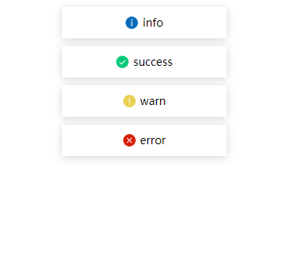
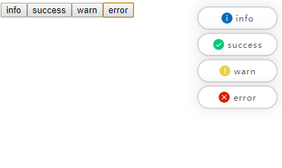

## Vue 全局消息提示组件 VueGlobalMessage
 > 自适应pc和m端样式

 >  pc
 >  m

[点击这里查看示例效果](https://crazymuyang.github.io/vue-global-message/index.html)

### 使用
 - step1 `npm install --save vue-global-message`
 - step2:
```javascript
  // main.js or nuxt plugins
  import Vue from 'vue'
  import VueGlobalMessage from 'vue-global-message'

  Vue.use(VueGlobalMessage, 
    {
      'zindex': 1000,   // default: 1000
      'duration': 15000 // default: 1500ms
    }
  )
```
 - step3:
``` javascript
  // page.vue
  this.$message.info('info type')
  this.$message.success('info success')
  this.$message.warn('info warn')
  this.$message.error('info error')
```